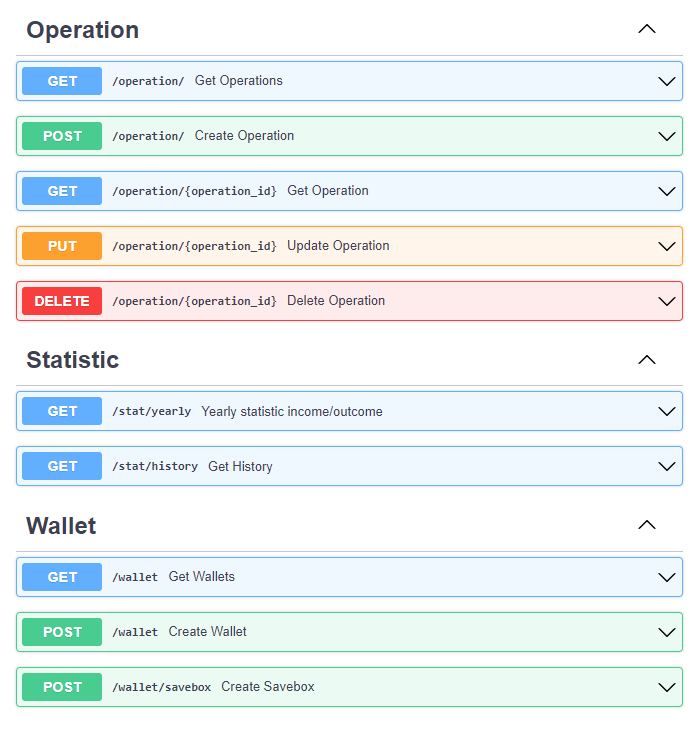

# API для учета финансов


Активация venv:
```
    .\venv\Scripts\activate
```

Запуск локального сервера:
```
    uvicorn src.app:app --reload
```

Запуск тестов:
```
    pytest --log-cli-level=INFO
```




